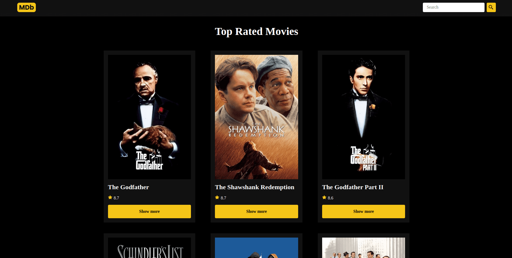

<h1 align="center"> IMDb Clone 🎬 </h1>

## 💻 Descrição

Uma aplicação web inspirada na IMDb. Nela é possível consultar o filmes mais bem avaliados e também procurar por um filme específico. Os dados são fornecidos por uma API externa.

## 🚀 Tecnologias

Esse projeto foi desenvolvido com as seguintes tecnologias:

- [React](https://react.dev/)
- [Vite](https://vitejs.dev/)
- [TMDB](https://www.themoviedb.org/)

## 🖥️ Screenshots

 

---

Feito com ❤️.